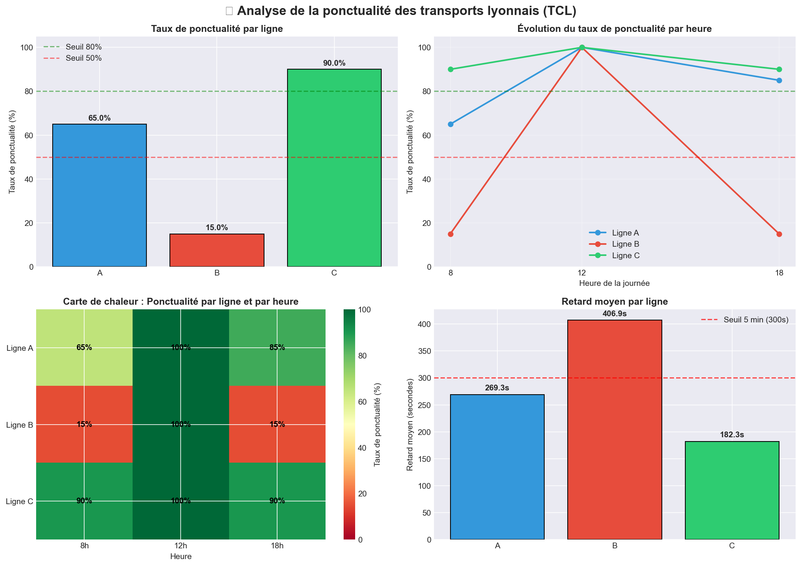

# analyse-ponctualite-tcl
Analyse de la ponctualité des transports lyonnais - Projet Data Analytics SQL

# 🚇 Analyse de la ponctualité des transports lyonnais (TCL)

## 📌 Contexte du projet

- Modéliser une problématique métier (la ponctualité des transports)
- Manipuler des données avec **SQL** (PostgreSQL)
- Visualiser des résultats avec **Python** (Matplotlib)

## 🎯 Problématique

**Identifier les lignes et les heures de la journée où les retards sont les plus critiques.**

### Règle métier
Un voyageur est considéré **à l'heure** si son retard est **inférieur à 5 minutes (300 secondes)**.

## 🛠️ Stack technique

| Outil | Usage |
|-------|-------|
| **PostgreSQL** | Stockage et analyse SQL |
| **Python (pandas)** | Génération des données et exports |
| **Matplotlib** | Dashboard de visualisation |

## 📊 Résultats clés

| Enseignement | Valeur |
|--------------|--------|
| 🔴 Ligne la moins ponctuelle | **Ligne B** (15% à l'heure aux heures de pointe) |
| ⏰ Heure la plus critique | **8h et 18h** |
| 🏆 Ligne la plus performante | **Ligne C** (100% à 12h) |

### Détail par ligne et par heure

| Ligne | 8h | 12h | 18h |
|-------|-----|-----|-----|
| **A** | 65% | - | 85% |
| **B** | 15% | - | 15% |
| **C** | 90% | 100% | 90% |

## 📈 Dashboard



## 🔍 Extrait SQL (requête principale)

```sql
WITH analyse_ponctualite AS (
    SELECT 
        r.route_short_name AS ligne,
        EXTRACT(HOUR FROM st.arrival_time) AS heure,
        ROUND(100.0 * SUM(CASE WHEN st.retard_secondes < 300 THEN 1 ELSE 0 END) / COUNT(*), 2) AS taux_ponctualite_pct
    FROM stop_times st
    JOIN trips t ON st.trip_id = t.trip_id
    JOIN routes r ON t.route_id = r.route_id
    GROUP BY r.route_short_name, heure
)
SELECT * FROM analyse_ponctualite
ORDER BY taux_ponctualite_pct ASC;
